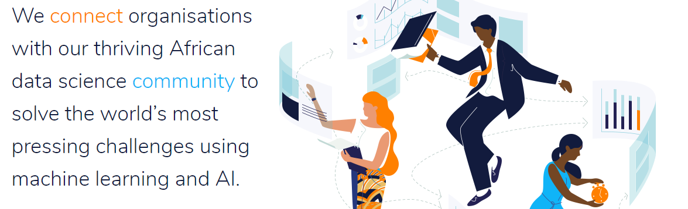

# [Zindi África](https://zindi.africa/)

- Repositorio para competencias en Data Science en África. **Lista de competencias en las cuales participo o participé en algún momento:**
  - **Competencias:**
    - [Prediccion de inundaciones en Malawi.](https://zindi.africa/competitions/2030-vision-flood-prediction-in-malawi)
    - [Visualización de inundaciones en Malawi.](https://zindi.africa/competitions/2030-vision-data-visualization-and-reporting-challenge)
    - [Pronóstico de calidad de aire (PM2.5) en Uganda.](https://zindi.africa/competitions/airqo-ugandan-air-quality-forecast-challenge)
    - [Predicción de salud mental basada en tweets - Kenia.](https://zindi.africa/competitions/basic-needs-basic-rights-kenya-tech4mentalhealth)
    - [Sistema/motor de recomendación de restaurantes en Omán.](https://zindi.africa/competitions/akeed-restaurant-recommendation-challenge)
    - [Animal Insights Challenge Zimbabwe.](https://zindi.africa/competitions/animal-insights-challenge)
  - **Hackatons:**
    - [Abandono de clientes en polizas de seguro.](https://zindi.africa/hackathons/the-zimnat-insurance-assurance-challenge)
    - [Clasificación de texto (COVID19) basada en tweets.](https://zindi.africa/hackathons/covid-19-tweet-classification-challenge)